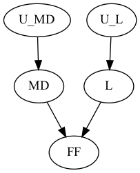

# Causal Explainer
A simple Python implementation of causes and explanations based on structural causal models, including the Halpern-Pearl definitions of actual causes and explanations, the Chockler-Halpern definitions of blame and responsibility, and the Miller definitions of contrastive causes and explanations.

*Note that causal models are restricted to those with discrete variables and are represented as causal networks, while structural equations should be represented as Python functions that accept as input a dictionary mapping parent variables to values.*

## Usage

```python
>>> from causal_explainer.halpern_pearl.causes import CausalNetwork, CausalSetting, PrimitiveEvent, search_candidate_causes, is_actual_cause
>>> exogenous_domains = {'U_L': {False, True}, 'U_MD': {False, True}}
>>> endogenous_domains = {'FF': {False, True}, 'L': exogenous_domains['U_L'], 'MD': exogenous_domains['U_MD']}
>>> causal_network = CausalNetwork()
>>> causal_network.add_dependency('FF', ['L', 'MD'], lambda parent_values: parent_values['L'] or parent_values['MD'])
>>> causal_network.add_dependency('L', ['U_L'], lambda parent_values: parent_values['U_L'])
>>> causal_network.add_dependency('MD', ['U_MD'], lambda parent_values: parent_values['U_MD'])
>>> context = {'U_L': True, 'U_MD': True}
>>> causal_setting = CausalSetting(causal_network, context, exogenous_domains, endogenous_domains)
>>> event = PrimitiveEvent('FF', True)
>>> list(search_candidate_causes(event, causal_setting, is_actual_cause))
[{'FF': True}, {'L': True, 'MD': True}]
```



# Related Software
- [hp2sat](https://github.com/amjadKhalifah/HP2SAT1.0): Java library for actual causality computation

# References
- Tim Miller. [Contrastive explanation: A structural-model approach](https://doi.org/10.1017/S0269888921000102). The Knowledge Engineering Review, 36, E14, 2021.
- Joseph Y. Halpern. [Actual causality](https://mitpress.mit.edu/books/actual-causality). MIT Press, 2016.
- Joseph Y. Halpern. [A Modification of the Halpern-Pearl Definition of Causality](https://www.ijcai.org/Proceedings/15/Papers/427.pdf). In *Proceedings of the 24th International Joint Conference on Artificial Intelligence (IJCAI'15)*, pages 3022-3033, 2015.
