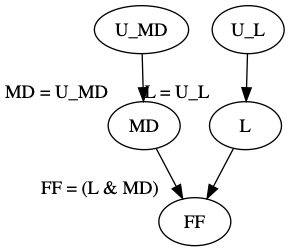
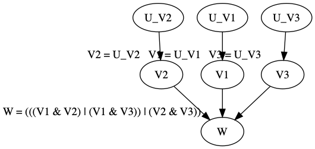
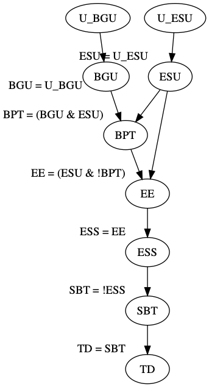
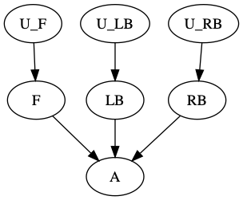

# PyActualCausality
A simple Python implementation of the (modified) Halpern-Pearl definition of actual causality.

*Note that causal models are restricted to those with finite-domain endogenous variables and structural equations expressed using Python lambda expressions.*

## Examples

### Forest Fire
This example involves three endogenous variables: a forest fire `FF`, a lightning strike `L`, and a match dropped by an arsonist `MD`.
The values of these variables are defined in two different causal models, known as the conjunctive and disjunctive models, based on two exogenous variables `U_L` and `U_MD`.

#### Conjunctive Model
In the conjunctive model the structural equations are defined as `FF = (L & MD)`, `L = U_L`, and `MD = U_MD`.

```python
>>> from actualcausality.boolean_combinations import PrimitiveEvent
>>> from actualcausality.hp_definition import Variable, CausalNetwork, CausalSetting, find_actual_causes, degrees_of_responsibility
>>> U_L, U_MD = Variable("U_L"), Variable("U_MD")
>>> FF, L, MD = Variable("FF"), Variable("L"), Variable("MD")
>>> exogenous_variables = {U_L, U_MD}
>>> endogenous_domains = {
...     FF: {False, True},
...     L: {False, True},
...     MD: {False, True}
... }
>>> causal_network = CausalNetwork()
>>> causal_network.add_dependency(FF, [L, MD], lambda parent_values: parent_values[L] and parent_values[MD])
>>> causal_network.add_dependency(L, [U_L], lambda parent_values: parent_values[U_L])
>>> causal_network.add_dependency(MD, [U_MD], lambda parent_values: parent_values[U_MD])
>>> context = {U_L: True, U_MD: True}
>>> causal_setting = CausalSetting(causal_network, context, endogenous_domains)
>>> event = PrimitiveEvent(FF, True)
>>> list(find_actual_causes(event, causal_setting))
[{FF: True}, {L: True}, {MD: True}]
>>> degrees_of_responsibility(event, causal_setting)
{FF: {False: 0, True: 1.0}, L: {False: 0, True: 1.0}, MD: {False: 0, True: 1.0}}
```


#### Disjunctive Model
In the disjunctive model the structural equations are defined as `FF = (L | MD)`, `L = U_L`, and `MD = U_MD`.

```python
>>> from actualcausality.boolean_combinations import PrimitiveEvent, Negation
>>> from actualcausality.hp_definition import Variable, CausalNetwork, CausalSetting, find_actual_causes, degrees_of_responsibility, CausalFormula
>>> U_L, U_MD = Variable("U_L"), Variable("U_MD")
>>> FF, L, MD = Variable("FF"), Variable("L"), Variable("MD")
>>> exogenous_variables = {U_L, U_MD}
>>> endogenous_domains = {
...     FF: {False, True},
...     L: {False, True},
...     MD: {False, True}
... }
>>> causal_network = CausalNetwork()
>>> causal_network.add_dependency(FF, [L, MD], lambda parent_values: parent_values[L] or parent_values[MD])
>>> causal_network.add_dependency(L, [U_L], lambda parent_values: parent_values[U_L])
>>> causal_network.add_dependency(MD, [U_MD], lambda parent_values: parent_values[U_MD])
>>> context = {U_L: True, U_MD: True}
>>> causal_setting = CausalSetting(causal_network, context, endogenous_domains)
>>> event = PrimitiveEvent(FF, True)
>>> list(find_actual_causes(event, causal_setting))
[{FF: True}, {MD: True, L: True}]
>>> degrees_of_responsibility(event, causal_setting)
{FF: {False: 0, True: 1.0}, L: {False: 0, True: 0.5}, MD: {False: 0, True: 0.5}}
```



### Rock Throwing
This example involves five endogenous variables: Suzy throws a rock `ST`, Billy throws a rock `BT`, Suzy hits the bottle `SH`, Billy hits the bottle `BH`, and the bottle shatters `BS`.
The values of these variables are defined in a causal model based on two exogenous variables `U_ST` and `U_BT` where the structural equations are defined as `ST = U_ST`, `BT = U_BT`, `SH = ST`, `BH = (BT & !SH)`, and `BS = (SH | BH)`.

```python
>>> from actualcausality.boolean_combinations import PrimitiveEvent
>>> from actualcausality.hp_definition import Variable, CausalNetwork, CausalSetting, find_actual_causes, degrees_of_responsibility
>>> U_ST, U_BT = Variable("U_ST"), Variable("U_BT")
>>> ST, BT, SH, BH, BS = Variable("ST"), Variable("BT"), Variable("SH"), Variable("BH"), Variable("BS")
>>> exogenous_variables = {U_ST, U_BT}
>>> endogenous_domains = {
...     ST: {False, True},
...     BT: {False, True},
...     SH: {False, True},
...     BH: {False, True},
...     BS: {False, True}
... }
>>> causal_network = CausalNetwork()
>>> causal_network.add_dependency(ST, [U_ST], lambda parent_values: parent_values[U_ST])
>>> causal_network.add_dependency(BT, [U_BT], lambda parent_values: parent_values[U_BT])
>>> causal_network.add_dependency(SH, [ST], lambda parent_values: parent_values[ST])
>>> causal_network.add_dependency(BH, [BT, SH], lambda parent_values: parent_values[BT] and not parent_values[SH])
>>> causal_network.add_dependency(BS, [SH, BH], lambda parent_values: parent_values[SH] or parent_values[BH])
>>> context = {U_ST: True, U_BT: True}
>>> causal_setting = CausalSetting(causal_network, context, endogenous_domains)
>>> event = PrimitiveEvent(BS, True)
>>> list(find_actual_causes(event, causal_setting))
[{SH: True}, {BS: True}, {ST: True}]
>>> degrees_of_responsibility(event, causal_setting)
{ST: {False: 0, True: 0.5}, BT: {False: 0, True: 0}, SH: {False: 0, True: 0.5}, BH: {False: 0, True: 0}, BS: {False: 0, True: 1.0}}
```


### Voting
This example involves four endogenous variables: person 1 votes for Suzy `V1`, person 2 votes for Suzy `V2`, person 3 votes for Suzy `V3`, and Suzy wins `W`.
The values of these variables are defined in a causal model based on three exogenous variables `U_V1`, `U_V2`, and `U_V3` where the structural equations are defined as `V1 = U_V1`, `V2 = U_V2`, `V3 = U_V3`, and `W = ((V1 & V2) | (V1 & V3) | (V2 & V3))`.

```python
>>> from actualcausality.boolean_combinations import PrimitiveEvent
>>> from actualcausality.hp_definition import Variable, CausalNetwork, CausalSetting, find_actual_causes, degrees_of_responsibility
>>> U_V1, U_V2, U_V3 = Variable("U_V1"), Variable("U_V2"), Variable("U_V3")
>>> V1, V2, V3, W = Variable("V1"), Variable("V2"), Variable("V3"), Variable("W")
>>> exogenous_variables = {U_V1, U_V2, U_V3}
>>> endogenous_domains = {
...     V1: {False, True},
...     V2: {False, True},
...     V3: {False, True},
...     W: {False, True}
... }
>>> causal_network = CausalNetwork()
>>> causal_network.add_dependency(V1, [U_V1], lambda parent_values: parent_values[U_V1])
>>> causal_network.add_dependency(V2, [U_V2], lambda parent_values: parent_values[U_V2])
>>> causal_network.add_dependency(V3, [U_V3], lambda parent_values: parent_values[U_V3])
>>> causal_network.add_dependency(W, [V1, V2, V3], lambda parent_values: ((parent_values[V1] and parent_values[V2]) or (parent_values[V1] and parent_values[V3])) or (parent_values[V2] and parent_values[V3]))
>>> context = {U_V1: True, U_V2: True, U_V3: True}
>>> causal_setting = CausalSetting(causal_network, context, endogenous_domains)
>>> event = PrimitiveEvent(W, True)
>>> list(find_actual_causes(event, causal_setting))
[{W: True}, {V3: True, V2: True}, {V3: True, V1: True}, {V2: True, V1: True}]
>>> degrees_of_responsibility(event, causal_setting)
{V1: {False: 0, True: 0.5}, V2: {False: 0, True: 0.5}, V3: {False: 0, True: 0.5}, W: {False: 0, True: 1.0}}
```



### Double Prevention
This example involves seven endogenous variables: Billy goes up `BGU`, enemy shows up `ESU`, Billy pulls trigger `BPT`, enemy eludes `EE`, enemy shoots Suzy `ESS`, Suzy bombs target `SBT`, and target is destroyed `TD`.
The values of these variables are defined in a causal model based on two exogenous variables `U_BGU` and `U_ESU` where the structural equations are defined as `BGU = U_BGU`, `ESU = U_ESU`, `BPT = (BGU & ESU)`, `EE = (ESU & !BPT)`, `ESS = EE`, `SBT = !ESS`, and `TD = SBT`.

```python
>>> from actualcausality.boolean_combinations import PrimitiveEvent
>>> from actualcausality.hp_definition import Variable, CausalNetwork, CausalSetting, find_actual_causes, degrees_of_responsibility
>>> U_BGU, U_ESU = Variable("U_BGU"), Variable("U_ESU")
>>> BGU, ESU, BPT, EE, ESS, SBT, TD = Variable("BGU"), Variable("ESU"), Variable("BPT"), Variable("EE"), Variable("ESS"), Variable("SBT"), Variable("TD")
>>> exogenous_variables = {U_BGU, U_ESU}
>>> endogenous_domains = {
...     BGU: {False, True},
...     ESU: {False, True},
...     BPT: {False, True},
...     EE: {False, True},
...     ESS: {False, True},
...     SBT: {False, True},
...     TD: {False, True}
... }
>>> causal_network = CausalNetwork()
>>> causal_network.add_dependency(BGU, [U_BGU], lambda parent_values: parent_values[U_BGU])
>>> causal_network.add_dependency(ESU, [U_ESU], lambda parent_values: parent_values[U_ESU])
>>> causal_network.add_dependency(BPT, [BGU, ESU], lambda parent_values: parent_values[BGU] and parent_values[ESU])
>>> causal_network.add_dependency(EE, [ESU, BPT], lambda parent_values: parent_values[ESU] and not parent_values[BPT])
>>> causal_network.add_dependency(ESS, [EE], lambda parent_values: parent_values[EE])
>>> causal_network.add_dependency(SBT, [ESS], lambda parent_values: not parent_values[ESS])
>>> causal_network.add_dependency(TD, [SBT], lambda parent_values: parent_values[SBT])
>>> context = {U_BGU: True, U_ESU: False}
>>> causal_setting = CausalSetting(causal_network, context, endogenous_domains)
>>> event = PrimitiveEvent(TD, True)
>>> list(find_actual_causes(event, causal_setting))
[{ESU: False}, {EE: False}, {SBT: True}, {TD: True}, {ESS: False}]
>>> degrees_of_responsibility(event, causal_setting)
{BGU: {False: 0, True: 0}, ESU: {False: 0.5, True: 0}, BPT: {False: 0, True: 0}, EE: {False: 1.0, True: 0}, ESS: {False: 1.0, True: 0}, SBT: {False: 0, True: 1.0}, TD: {False: 0, True: 1.0}}
```



### Railroad
This example involves four endogenous variables: engineer flips the switch `F`, left track is blocked `LB`, right track is blocked `RB`, and the train arrives `A`.
The values of these variables are defined in a causal model based on three exogenous variables `U_F`, `U_LB`, and `U_RB` where the structural equations are defined as `F = U_F`, `LB = U_LB`, `RB = U_RB`, and `A = ((F & !LB) | (!F & !RB))`.

```python
>>> from actualcausality.boolean_combinations import PrimitiveEvent
>>> from actualcausality.hp_definition import Variable, CausalNetwork, CausalSetting, find_actual_causes, degrees_of_responsibility
>>> U_F, U_LB, U_RB = Variable("U_F"), Variable("U_LB"), Variable("U_RB")
>>> F, LB, RB, A = Variable("F"), Variable("LB"), Variable("RB"), Variable("A")
>>> exogenous_variables = {U_F, U_LB, U_RB}
>>> endogenous_domains = {
...     F: {False, True},
...     LB: {False, True},
...     RB: {False, True},
...     A: {False, True}
... }
>>> causal_network = CausalNetwork()
>>> causal_network.add_dependency(F, [U_F], lambda parent_values: parent_values[U_F])
>>> causal_network.add_dependency(LB, [U_LB], lambda parent_values: parent_values[U_LB])
>>> causal_network.add_dependency(RB, [U_RB], lambda parent_values: parent_values[U_RB])
>>> causal_network.add_dependency(A, [F, LB, RB], lambda parent_values: (parent_values[F] and not parent_values[LB]) or (not parent_values[F] and not parent_values[RB]))
>>> context = {U_F: True, U_LB: False, U_RB: False}
>>> causal_setting = CausalSetting(causal_network, context, endogenous_domains)
>>> event = PrimitiveEvent(A, True)
>>> list(find_actual_causes(event, causal_setting))
[{F: True, RB: False}, {A: True}, {LB: False}]
>>> degrees_of_responsibility(event, causal_setting)
{F: {False: 0, True: 0.5}, LB: {False: 1.0, True: 0}, RB: {False: 0.5, True: 0}, A: {False: 0, True: 1.0}}
```



### Arthropods
This example involves six endogenous variables: number of legs `L`, has stinger `S`, number of eyes `E`, has compound eyes `C`, has wings `W`, and classification output `O`.
The values of these variables are defined in a causal model based on five exogenous variables `U_L`, `U_S`, `U_E`, `U_C`, and `U_W` where the structural equations are defined as `L = U_L`, `S = U_S`, `E = U_E`, `C = U_C`, `W = U_W`, and:

| `O`       | `L` | `S`     | `E` | `C`     | `W` |
| --------- | --- | ------- | --- | ------- | --- |
| `spider`  | `8` | `False` | `8` | `False` | `0` |
| `beetle`  | `6` | `False` | `2` | `True`  | `2` |
| `bee`     | `6` | `True`  | `5` | `True`  | `4` |
| `fly`     | `6` | `False` | `5` | `True`  | `2` |
| `unknown` | ... | ...     | ... | ...     | ... |

```python
>>> from actualcausality.boolean_combinations import PrimitiveEvent
>>> from actualcausality.hp_definition import Variable, CausalNetwork, CausalSetting, find_actual_causes, degrees_of_responsibility
>>> from actualcausality.utils import issubdict
>>> U_L, U_S, U_E, U_C, U_W = Variable("U_L"), Variable("U_S"), Variable("U_E"), Variable("U_C"), Variable("U_W")
>>> L, S, E, C, W, O = Variable("L"), Variable("S"), Variable("E"), Variable("C"), Variable("W"), Variable("O")
>>> exogenous_variables = {U_L, U_S, U_E, U_C, U_W}
>>> endogenous_domains = {
...     L: {6, 8},
...     S: {False, True},
...     E: {2, 5, 8},
...     C: {False, True},
...     W: {0, 2, 4},
...     O: {"spider", "beetle", "bee", "fly", "unknown"}
... }
>>> causal_network = CausalNetwork()
>>> causal_network.add_dependency(L, [U_L], lambda parent_values: parent_values[U_L])
>>> causal_network.add_dependency(S, [U_S], lambda parent_values: parent_values[U_S])
>>> causal_network.add_dependency(E, [U_E], lambda parent_values: parent_values[U_E])
>>> causal_network.add_dependency(C, [U_C], lambda parent_values: parent_values[U_C])
>>> causal_network.add_dependency(W, [U_W], lambda parent_values: parent_values[U_W])
>>> causal_network.add_dependency(
...     O,
...     [L, S, E, C, W],
...     lambda parent_values:
...         "spider" if issubdict({L: 8, S: False, E: 8, C: False, W: 0}, parent_values)
...         else "beetle" if issubdict({L: 6, S: False, E: 2, C: True, W: 2}, parent_values)
...         else "bee" if issubdict({L: 6, S: True, E: 5, C: True, W: 4}, parent_values)
...         else "fly" if issubdict({L: 6, S: False, E: 5, C: True, W: 2}, parent_values)
...         else "unknown"
... )
>>> context = {U_L: 6, U_S: True, U_E: 5, U_C: True, U_W: 4}
>>> causal_setting = CausalSetting(causal_network, context, endogenous_domains)
>>> event = PrimitiveEvent(O, "bee")
>>> list(find_actual_causes(event, causal_setting))
[{S: True}, {O: 'bee'}, {L: 6}, {W: 4}, {E: 5}, {C: True}]
>>> degrees_of_responsibility(event, causal_setting)
{L: {8: 0, 6: 1.0}, S: {False: 0, True: 1.0}, E: {8: 0, 2: 0, 5: 1.0}, C: {False: 0, True: 1.0}, W: {0: 0, 2: 0, 4: 1.0}, O: {'fly': 0, 'spider': 0, 'unknown': 0, 'beetle': 0, 'bee': 1.0}}
```


# Related Software
- [hp2sat](https://github.com/amjadKhalifah/HP2SAT1.0): Java library for actual causality computation

# References
- Tim Miller. [Contrastive Explanation: A Structural-Model Approach](https://arxiv.org/abs/1811.03163). *arXiv:1811.03163*, 2018.
- Joseph Y. Halpern. [Actual causality](https://mitpress.mit.edu/books/actual-causality). MIT Press, 2016.
- Joseph Y. Halpern. [A Modification of the Halpern-Pearl Definition of Causality](https://www.ijcai.org/Proceedings/15/Papers/427.pdf). In *Proceedings of the 24th International Joint Conference on Artificial Intelligence (IJCAI'15)*, pages 3022-3033, 2015.
