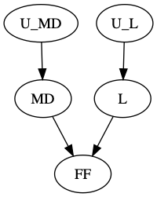

# PyActualCausality
A simple Python implementation of the (modified) Halpern-Pearl definition of actual causality, of the Chockler-Halpern definitions of blame and responsibility, and of the Miller definition of contrastive explanations.

*Note that causal models are restricted to those with discrete variables, while structural equations should be represented as Python functions that accept as input a dictionary mapping parent variables to values.*

## Usage

```python
>>> from lib.halpern_pearl import Variable, CausalNetwork, CausalSetting, find_actual_causes, PrimitiveEvent
>>> U_L, U_MD = Variable("U_L"), Variable("U_MD")
>>> FF, L, MD = Variable("FF"), Variable("L"), Variable("MD")
>>> exogenous_variables = {U_L, U_MD}
>>> endogenous_domains = {FF: {False, True}, L: {False, True}, MD: {False, True}}
>>> causal_network = CausalNetwork()
>>> causal_network.add_dependency(FF, [L, MD], lambda parent_values: parent_values[L] or parent_values[MD])
>>> causal_network.add_dependency(L, [U_L], lambda parent_values: parent_values[U_L])
>>> causal_network.add_dependency(MD, [U_MD], lambda parent_values: parent_values[U_MD])
>>> context = {U_L: True, U_MD: True}
>>> causal_setting = CausalSetting(causal_network, context, endogenous_domains)
>>> event = PrimitiveEvent(FF, True)
>>> list(find_actual_causes(event, causal_setting))
[{FF: True}, {L: True}, {MD: True}]
```



# Related Software
- [hp2sat](https://github.com/amjadKhalifah/HP2SAT1.0): Java library for actual causality computation

# References
- Tim Miller. [Contrastive Explanation: A Structural-Model Approach](https://arxiv.org/abs/1811.03163). *arXiv:1811.03163*, 2018.
- Joseph Y. Halpern. [Actual causality](https://mitpress.mit.edu/books/actual-causality). MIT Press, 2016.
- Joseph Y. Halpern. [A Modification of the Halpern-Pearl Definition of Causality](https://www.ijcai.org/Proceedings/15/Papers/427.pdf). In *Proceedings of the 24th International Joint Conference on Artificial Intelligence (IJCAI'15)*, pages 3022-3033, 2015.
