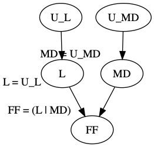
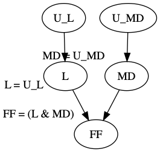
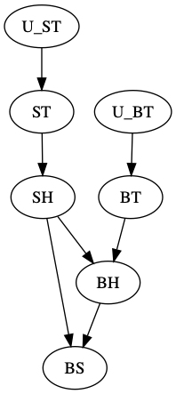

# actual-causality
A simple Python implementation of the (modified) Halpern-Pearl definition of actual causality.

*Note that causal models are restricted to those with Boolean variables and structural equations are restricted to propositional formulas.*

## Examples

### Forest Fire
This example involves three endogenous variables: a forest fire `FF`, a lightning strike `L`, and a match dropped by an arsonist `MD`.
The values of these variables are defined in two different causal models involving two exogenous variables `U_L` and `U_MD`.
In the conjunctive model the structural equations are defined as `FF = (L & MD)`, `L = U_L`, and `MD = U_MD`.
In the disjunctive model the structural equations are defined as `FF = (L | MD)`, `L = U_L`, and `MD = U_MD`.

#### Conjunctive Model
```python
>>> from boolean_combinations import Atom, Conjunction
>>> from hp_definition import CausalModel, CausalSetting, Variable, find_actual_causes
>>> u_l, u_md = Variable("U_L"), Variable("U_MD")
>>> ff, l, md = Variable("FF"), Variable("L"), Variable("MD")
>>> exogenous_variables = {u_l, u_md}
>>> structural_equations = {
...     ff: Conjunction(Atom(l), Atom(md)),
...     l: Atom(u_l),
...     md: Atom(u_md)
... }
>>> causal_model = CausalModel(exogenous_variables, structural_equations)
>>> context = {u_l: True, u_md: True}
>>> casual_setting = CausalSetting(causal_model, context)
>>> event = Atom(ff)
>>> find_actual_causes(event, casual_setting)
[{L: True}, {FF: True}, {MD: True}]
```



#### Disjunctive Model
```python
>>> from boolean_combinations import Atom, Disjunction
>>> from hp_definition import CausalModel, CausalSetting, Variable, find_actual_causes
>>> u_l, u_md = Variable("U_L"), Variable("U_MD")
>>> ff, l, md = Variable("FF"), Variable("L"), Variable("MD")
>>> exogenous_variables = {u_l, u_md}
>>> structural_equations = {
...     ff: Disjunction(Atom(l), Atom(md)),
...     l: Atom(u_l),
...     md: Atom(u_md)
... }
>>> causal_model = CausalModel(exogenous_variables, structural_equations)
>>> context = {u_l: True, u_md: True}
>>> casual_setting = CausalSetting(causal_model, context)
>>> event = Atom(ff)
>>> find_actual_causes(event, casual_setting)
[{FF: True}, {MD: True, L: True}]
```



### Rock Throwing
This example involves five endogenous variables: Sally throws a rock `ST`, Billy throws a rock `BT`, Sally hits the bottle `SH`, Billy hits the bottle `BH`, and the bottle shatters `BS`.
The values of these variables are defined in a causal model involving two exogenous variables `ST_exo` and `BT_exo` where the structural equations are defined as `ST = ST_exo`, `BT = BT_exo`, `SH = ST`, `BH = (BT & !SH)`, and `BS = (SH | BH)`.

```python
>>> from boolean_combinations import Atom, Conjunction, Disjunction, Negation
>>> from hp_definition import CausalModel, CausalSetting, Variable, find_actual_causes
>>> st_exo, bt_exo = Variable("ST_exo"), Variable("BT_exo")
>>> st, bt, sh, bh, bs = Variable("ST"), Variable("BT"), Variable("SH"), Variable("BH"), Variable("BS")
>>> exogenous_variables = {st_exo, bt_exo}
>>> structural_equations = {
...     st: Atom(st_exo),
...     bt: Atom(bt_exo),
...     sh: Atom(st),
...     bh: Conjunction(Atom(bt), Negation(Atom(sh))),
...     bs: Disjunction(Atom(sh), Atom(bh))
... }
>>> causal_model = CausalModel(exogenous_variables, structural_equations)
>>> context = {st_exo: True, bt_exo: True}
>>> casual_setting = CausalSetting(causal_model, context)
>>> event = Atom(bs)
>>> find_actual_causes(event, casual_setting)
[{SH: True}, {ST: True}, {BS: True}]
```



# Related Software
- [hp2sat](https://github.com/amjadKhalifah/HP2SAT1.0): Java library for actual causality computation

# References
- Joseph Y. Halpern. [Actual causality](https://mitpress.mit.edu/books/actual-causality). MIT Press, 2016.
- Joseph Y. Halpern. [A Modification of the Halpern-Pearl Definition of Causality](https://www.ijcai.org/Proceedings/15/Papers/427.pdf). In *Proceedings of the 24th International Joint Conference on Artificial Intelligence (IJCAI'15)*, pages 3022-3033, 2015.
